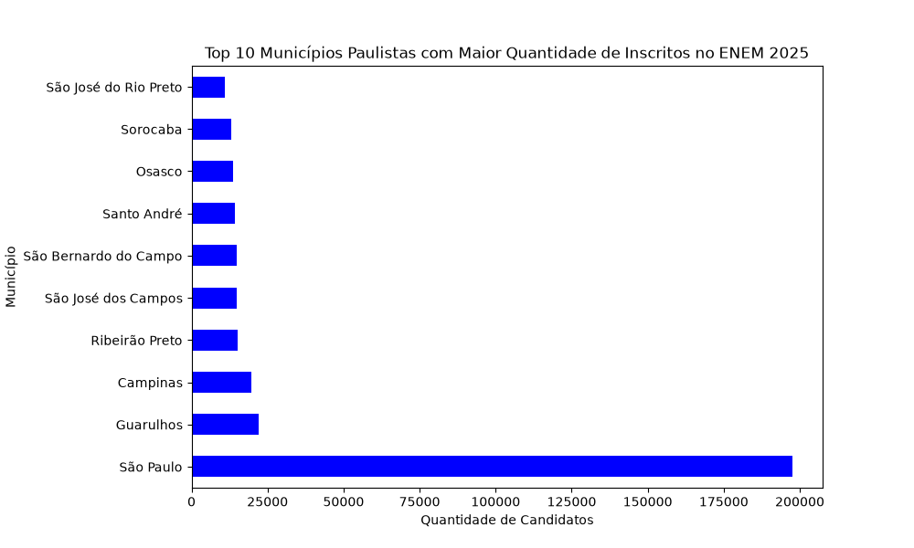
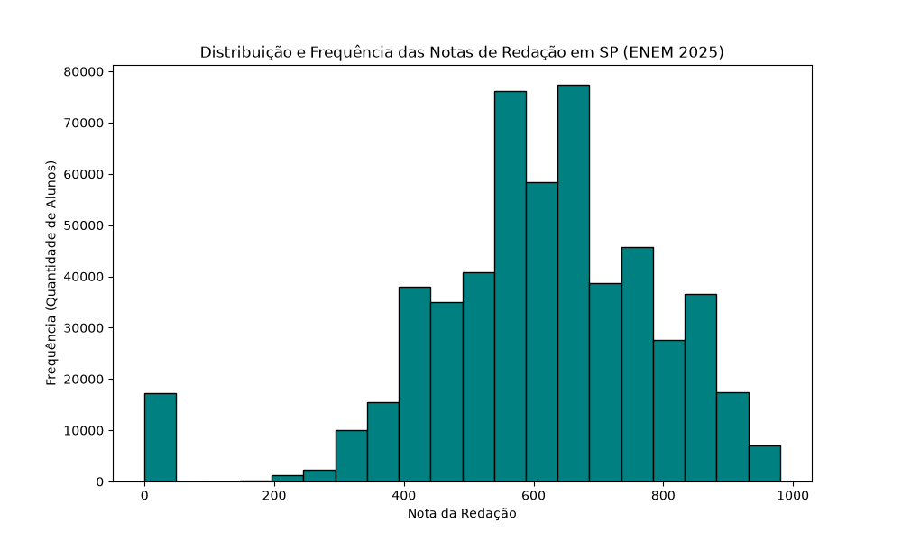
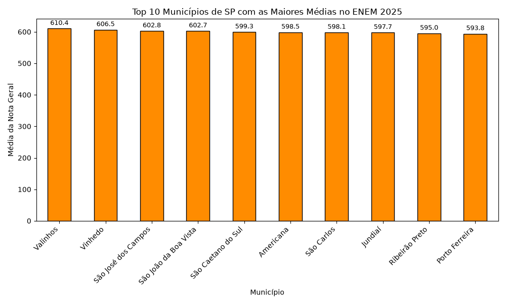

# Análise de Desempenho e Densidade Demográfica - ENEM 2025 (Escopo: São Paulo)

## 📌 Visão Geral do Projeto
Este projeto consiste no desenvolvimento de um pipeline completo de dados de ponta a ponta, focado na extração, tratamento e análise exploratória descritiva dos microdados do ENEM 2025 para o estado de São Paulo. 

O projeto demonstra a aplicação prática de conceitos avançados de **Engenharia de Dados** (manipulação de Big Data, processamento em lote e otimização de I/O de disco) combinados com **Ciência de Dados** (análise estatística descritiva, tratamento de outliers e engenharia de atributos).

---

## 🛠️ Arquitetura e Engenharia do Projeto (Pipeline de Dados)

Os microdados completos do ENEM disponibilizados pelo INEP possuem dimensões massivas (Big Data), inviabilizando a leitura direta e síncrona em memória RAM em computadores comuns. Para contornar essa restrição técnica, o projeto foi arquitetado de forma modular em dois estágios independentes:

### 1. Camada de ETL e Ingestão (`pipeline_extracao.py`)
Responsável pelo consumo eficiente do dataset nacional bruto (`RESULTADOS_2025.csv`).
* **Processamento em Lote (Batching):** Utilização da técnica de *Out-of-Core Processing* via Pandas, segmentando o arquivo em blocos dinâmicos (`chunksize=150000`). Isso garante um consumo de memória RAM linear e controlado.
* **Sanitização de Metadados:** Limpeza automatizada de strings residuais nas colunas do cabeçalho (`.str.strip()`).
* **Escrita Incremental:** Persistência em disco via modo de gravação sequencial (*Append Mode*), isolando apenas os registros cujo escopo geográfico (`SG_UF_PROVA`) pertença ao estado de São Paulo (`SP`), reduzindo um volume de gigabytes para um arquivo de trabalho otimizado.

### 2. Camada de Análise Exploratória e Estatística (`analise_exploratoria.py`)
Responsável pela modelagem, aplicação de regras de negócio e geração de insights em cima da base otimizada (`dados_enem_2025_SP.csv`).
* **Extração Dinâmica de Recursos:** Identificação em tempo de execução das colunas correspondentes às frentes de prova (`NU_NOTA_`), isolando competências acessórias.
* **Tratamento de Outliers:** Implementação de máscaras booleanas para expurgar registros ausentes (`notna()`) e notas nulas reais (`!= 0`) oriundas de desclassificações ou abstenções, garantindo a acurácia dos sumários estatísticos da Redação.
* **Filtro de Significância Estatística:** Agrupamento ponderado (`groupby`) que remove localidades com amostragem estatística irrelevante (menos de 100 inscritos) para mitigar distorções causadas por baixa amostragem no ranking de médias municipais.

---

## 📊 Análises Executadas e Métricas Extraídas

O script de análise foca em três pilares principais de negócios e performance acadêmica:

1. **Análise Volumétrica de Frequência (Densidade Populacional):** Mapeamento e renderização do Top 10 municípios paulistas com o maior volume absoluto de candidatos inscritos.
2. **Análise de Distribuição e Tendência Central:** Avaliação de dispersão, amplitude e assimetria das notas da prova de Redação através de histogramas de frequência e cálculo de sumários estatísticos (`min`, `mean`, `median`, `max`).
3. **Performance Educacional por Localidade:** Engenharia de atributos para o cálculo do score geral unificado por linha (`axis=1`) e rankeamento das 10 cidades de São Paulo com o melhor desempenho médio no exame nacional.

---

## 📁 Estrutura do Repositório

```text
├── pipeline_extracao.py     # Script focado em Engenharia de Dados (ETL em Lote)
├── analise_exploratoria.py   # Script focado em Ciência de Dados (Estatística e Gráficos)
├── .gitignore                # Restrição do Git para ignorar arquivos pesados (.csv, .zip)
└── README.md                 # Documentação técnica do projeto (este arquivo)
```

> **Nota de Performance:** Em conformidade com as boas práticas de engenharia de software, as bases de dados brutas e intermediárias (`.csv`) são intencionalmente ignoradas pelo controle de versão através do arquivo `.gitignore` devido ao seu volume, assegurando a leveza e reprodutibilidade do repositório.

---

## 🚀 Como Executar o Projeto

### Pré-requisitos
Certifique-se de ter o Python 3 instalado juntamente com as bibliotecas necessárias:
```bash
pip install pandas matplotlib
```

### Passo 1: Download da Base Bruta
Baixe o arquivo de microdados brutos do ENEM 2025 diretamente no portal oficial de dados abertos do INEP. Nomeie o arquivo como `RESULTADOS_2025.csv` e coloque-o na mesma pasta dos scripts.

### Passo 2: Execução da Extração (ETL)
Execute o primeiro script para segmentar a base nacional e gerar o arquivo focado em São Paulo:
```bash
python pipeline_extracao.py
```

### Passo 3: Execução das Visualizações e Estatísticas (EDA)
Com a base de São Paulo gerada, execute o script de análise para gerar os sumários numéricos no console e abrir as janelas de gráficos do Matplotlib simultaneamente:
```bash
python analise_exploratoria.py
```

---

## 🛠️ Tecnologias Utilizadas
* **Python 3.14**
* **Pandas:** Ingestão orientada a chunks, manipulação matricial, tratamento de nulos e agregações complexas.
* **Matplotlib:** Engenharia de gráficos e renderização de matrizes visuais de distribuição (Histogramas) e frequência (Barras com data labels).

### Visualização dos Resultados Visuais (Gráficos)

#### 1. Volumetria de Inscritos por Localidade


#### 2. Distribuição e Frequência das Notas de Redação


#### 3. Desempenho Médio Geral por Cidade (Significância > 100 inscritos)

